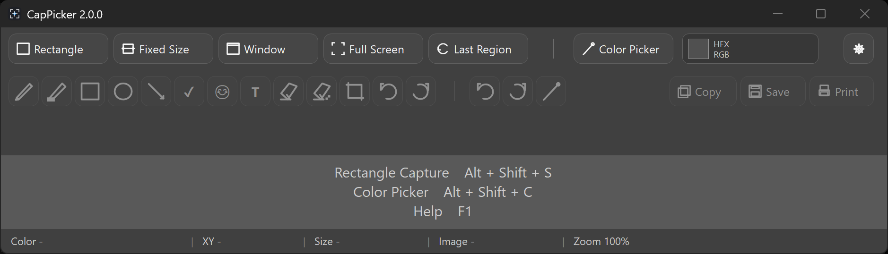
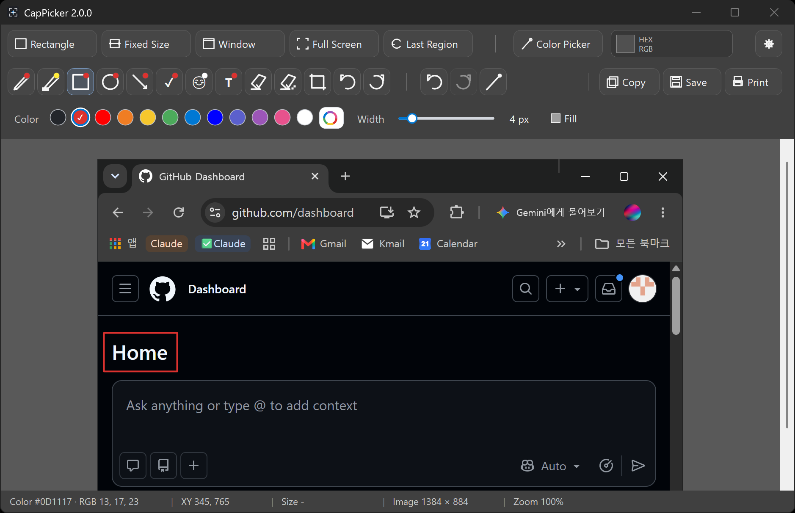
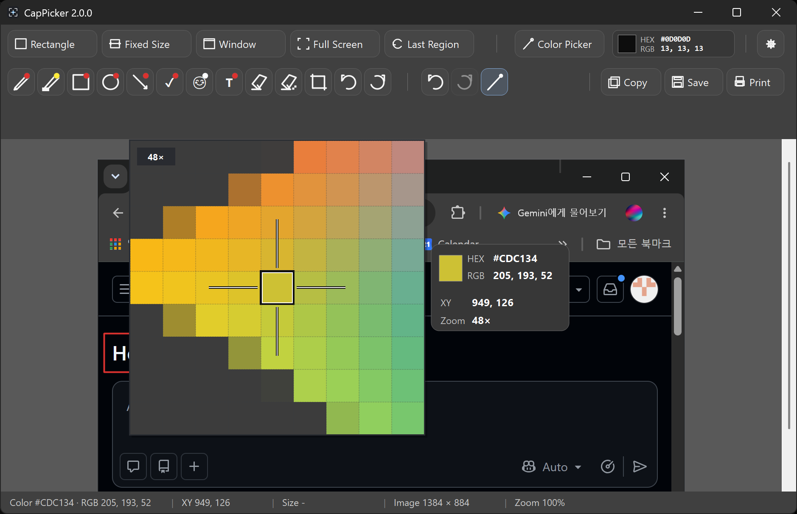
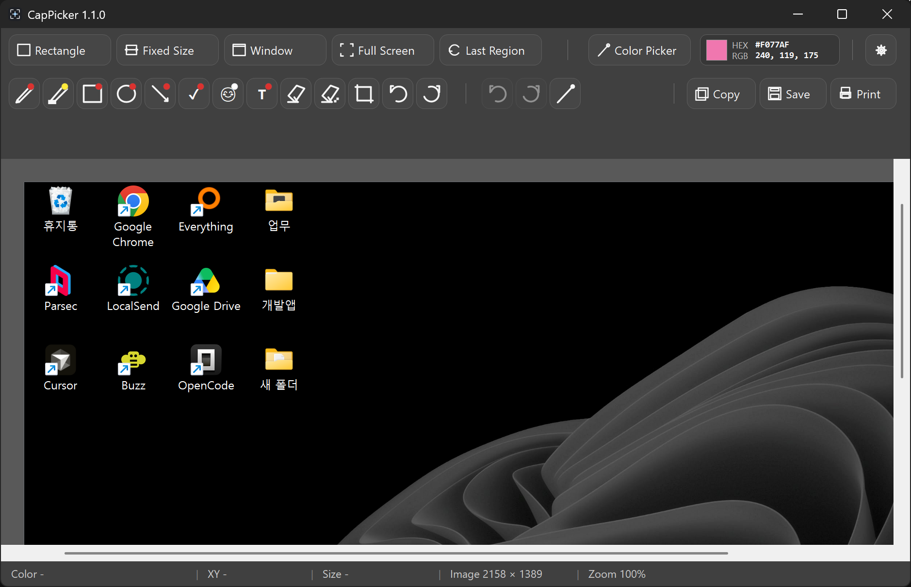
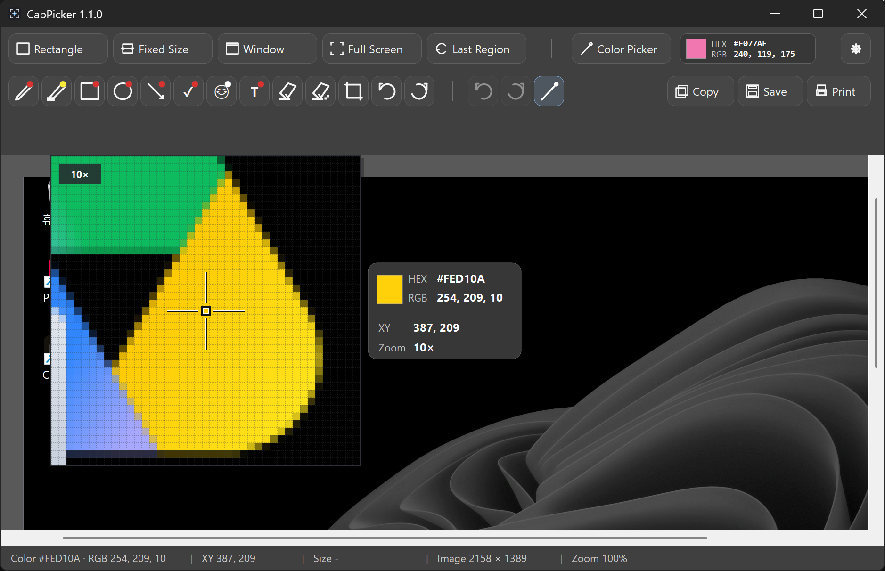

# CapPicker

CapPicker is a Windows utility that combines screen capture, color picking, quick image editing, and printing.

CapPicker는 화면 캡처, 색상 추출, 간단한 이미지 편집과 인쇄를 한곳에서 처리하는 Windows용 도구입니다.

Current version / 현재 버전: **1.1.7**

## Features / 주요 기능

- Rectangle, fixed-size, window, full-screen, and last-region capture / 사각형, 고정 크기, 창, 전체 화면, 마지막 영역 캡처
- Screen and image color pickers / 화면 및 캡처 이미지 내부 컬러피커
- Live HEX/RGB, pixel grid, center crosshair, and 6×–128× magnification / 실시간 HEX/RGB, 픽셀 격자, 중심 십자선, 6×~128× 확대
- Pen, highlighter, shapes, arrow, check mark, text, eraser, crop, rotate, undo, and redo / 펜, 형광펜, 도형, 화살표, 체크, 텍스트, 지우개, 자르기, 회전, 실행 취소/다시 실행
- Image measurement and zoom up to 1000% / 캡처 이미지 크기 측정과 최대 1000% 확대
- Print preview with orientation and horizontal/vertical alignment / 용지 방향 및 가로·세로 맞춤을 지원하는 인쇄 미리보기
- Korean and English UI with automatic Windows display-language detection / Windows 표시 언어를 자동 감지하는 한국어·영어 UI
- Configurable taskbar/tray minimize and close behavior / 작업표시줄·트레이 최소화 및 닫기 동작 설정
- Normal and low-spec PC performance modes / 일반 및 저사양 PC 성능 모드
- Windows scaling from 100% to 200% and mixed-DPI monitor support / Windows 배율 100%~200% 및 혼합 DPI 모니터 지원

## Download and run / 다운로드 및 실행

Download `CapPicker.exe` from the latest [Release](https://github.com/jjaeeungm/CapPicker/releases) and run it.

[Releases](https://github.com/jjaeeungm/CapPicker/releases)에서 최신 릴리즈의 `CapPicker.exe`를 내려받아 실행하세요.

The current distribution contains one file: `CapPicker.exe`. No installer or ZIP package is provided.

현재 배포 파일은 `CapPicker.exe` 하나이며, 별도 설치 프로그램이나 ZIP 패키지는 제공하지 않습니다.

Windows may display a security warning for an executable downloaded from the internet. Verify the source before choosing whether to run it.

Windows에서 인터넷에서 받은 실행 파일에 대한 보안 경고가 표시될 수 있으므로 파일 출처를 확인한 뒤 실행 여부를 선택하세요.

## Shortcuts / 단축키

| Action / 기능 | Shortcut / 단축키 |
| --- | --- |
| Rectangle capture / 사각형 캡처 | `Alt + Shift + S` |
| Screen color picker / 화면 컬러피커 | `Alt + Shift + C` |
| Help / 도움말 | `F1` |
| Copy / 복사 | `Ctrl + C` |
| Save / 저장 | `Ctrl + S` |
| Print preview / 인쇄 미리보기 | `Ctrl + P` |
| Undo / 실행 취소 | `Ctrl + Z` |
| Redo / 다시 실행 | `Ctrl + Y` |
| Image zoom / 이미지 확대·축소 | `Ctrl + Mouse Wheel` / `Ctrl + 마우스 휠` |

## Settings / 설정

Use the gear button in the top toolbar to configure the following options.

상단의 톱니바퀴 버튼에서 다음 항목을 변경할 수 있습니다.

- Language / 언어: Windows setting (Auto) / Windows 설정(자동), 한국어, English
- Minimize button / 최소화 버튼: Taskbar / 작업표시줄 or Tray / 트레이
- Close button / 닫기 버튼: Tray / 트레이 or Exit app / 앱 종료
- Performance / 성능: Normal / 일반 or Low-spec PC optimization / 저사양 PC 최적화

Settings are stored in `%LocalAppData%\CapPicker`. / 설정은 `%LocalAppData%\CapPicker`에 저장됩니다.

## Build from source / 소스에서 빌드

CapPicker is written in C# WinForms and uses the Windows .NET Framework toolchain.

CapPicker는 C# WinForms로 작성되었으며 Windows .NET Framework 도구 체인을 사용합니다.

1. Clone the repository or download the source code. / 저장소를 복제하거나 소스 코드를 내려받습니다.
2. Keep all source files in the same directory. / 모든 소스 파일을 같은 폴더에 둡니다.
3. Run `BUILD.cmd`. / `BUILD.cmd`를 실행합니다.
4. A successful build creates and launches `CapPicker.exe` in the same directory. / 빌드가 성공하면 같은 폴더에 `CapPicker.exe`가 생성되고 실행됩니다.

If the C# compiler is unavailable, enable **.NET Framework 4.8 Advanced Services** in Windows Features.

C# 컴파일러를 찾지 못하면 Windows 기능에서 **.NET Framework 4.8 Advanced Services**를 활성화하세요.

## Screenshots / 스크린샷

## What's new in 1.1.7 / 1.1.7 변경 사항

- Improved spacing and alignment in the print-preview toolbar / 인쇄 미리보기 상단 옵션의 간격과 정렬 개선
- Unified setting-label and button heights / 설정 라벨과 버튼 높이 통일
- Wider Print and Close buttons to prevent clipped text / 인쇄·닫기 버튼 폭 확대 및 텍스트 잘림 방지
- Increased the minimum print-preview window width / 인쇄 미리보기 최소 폭 확대
